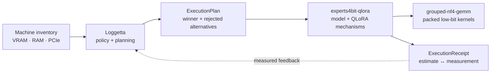

<div align="center">

# Loggetta

### Plan first. Load later.

**Decide how a workload should run on this machine, explain why, and refuse impossible plans before loading weights.**

<p>
  =3.10">
  
  
  
</p>

</div>

---

Loggetta is a planning and policy layer above
[experts4bit-qlora](https://github.com/pjordanandrsn/experts4bit-qlora) and
[grouped-nf4-gemm](https://github.com/pjordanandrsn/grouped-nf4-gemm). Its current focus is single-GPU MoE
training and serving: inventory the machine, price candidate configurations, choose among them under explicit
budgets and objectives, and say **why** a plan won or **why nothing fits**.

> [!NOTE]
> The lower layers own mechanism. **Loggetta owns policy.**

| Plan before loading | Explain every choice | Learn from measurements |
| :--- | :--- | :--- |
| Price candidate configurations before touching model weights. | Keep the winning setup, rejected alternatives, and refusal reasons inspectable. | Write receipts that put estimates beside measured memory, timing, correctness, and provenance. |

## How it fits together



The dependency direction stays intentionally simple:

```text
planner -> experts4bit-qlora -> grouped-nf4-gemm
```

## Quick start

```bash
# What machine am I actually on?
python -m loggetta inspect

# What should run here?
python -m loggetta plan Qwen/Qwen3-30B-A3B --seq 2048

# Constrain the search deliberately
python -m loggetta plan allenai/OLMoE-1B-7B-0924 --experts device --vram 6

# Execute a supported plan and write the receipt
python -m loggetta train allenai/OLMoE-1B-7B-0924 --seq 512 --micro-batch 2 --steps 12 --out receipts/
```

### Three levels of control

| Mode | Example | What it means |
| :--- | :--- | :--- |
| **Automatic** | `plan MODEL` | Let policy choose among supported candidates. |
| **Directed** | `--vram`, `--ram`, `--experts`, `--objective` | State the budget or goal without hand-building the backend setup. |
| **Expert** | `--fix FIELD=VALUE` | Pin a backend setup field and make the remaining search work around it. |

`plan()` returns a deterministic, serializable `ExecutionPlan`. It includes the alternatives that lost and why.
`execute(plan)` runs a supported plan and writes an `ExecutionReceipt` with the estimate and measurement side by side.

## Evidence, not vibes

Loggetta is deliberately **not** a performance oracle. It records what it knows, labels heuristics, refuses plans
it cannot support, and learns memory overheads from receipts.

Current checks from [`docs/RESULTS.md`](docs/RESULTS.md):

| Check | Measured result |
| :--- | :--- |
| **Planner parity, A2000 / OLMoE** | Planned and hand-composed paths had **bitwise-identical step-1 loss** (`1.858969`), effectively identical allocator peaks (`5.4710` vs `5.4706 GiB`), and the same `60,817,408` trainable parameters. |
| **Allocator estimates, A2000** | Across six measured runs spanning three model families, estimates landed **+0.01 to +0.21 GiB** from measured peaks. |
| **Qwen3-30B-A3B, RTX 5090** | Allocator estimate **22.09 GiB**, measured **21.91 GiB**. After receipt-calibrated runtime overheads: planned process peak **24.54 GiB**, measured **24.34 GiB**. |
| **Host offload** | Transfer time is treated as a **lower bound**, not a fabricated step-time prediction. |

> [!IMPORTANT]
> A receipt carries provenance, allocator / reserved / driver peaks, correctness checks, engagement evidence,
> and estimate-vs-measured deltas. A heuristic stays labelled as a heuristic.

## Current scope

<table>
<tr>
<th>Supported today</th>
<th>Not claimed yet</th>
</tr>
<tr>
<td valign="top">

- ✅ Single-GPU MoE planning
- ✅ QLoRA training planning and supported execution through `experts4bit-qlora`
- ✅ Serving placement across device, host, and storage tiers
- ✅ Measured-memory feedback through receipts
- ✅ Deterministic, inspectable plans and refusals
- ✅ Explicit constraints instead of hidden “magic” defaults

</td>
<td valign="top">

- ⏳ Dense-model planning as a first-class Loggetta backend
- ⏳ Multi-GPU placement or execution planning
- ⏳ Calibrated throughput prediction
- ⏳ Profile-driven serving hot sets
- ⏳ Automatic execution of every serving plan

</td>
</tr>
</table>

Those are roadmap items, not assumptions hidden inside current results.

## Install

Until the functional PyPI release lands, install from source:

```bash
git clone https://github.com/pjordanandrsn/loggetta
cd loggetta
python -m pip install -e ".[experts4bit]"
```

The required lower-layer APIs are present in:

- `experts4bit-qlora >= 0.48.0`
- `grouped-nf4-gemm >= 0.41.0`

No development branches or `PYTHONPATH` overrides are required for those interfaces.

> [!TIP]
> PyPI `0.0.1` is reserved for a metadata-only preview that establishes the project name. Functional releases
> will supersede it.

## Why a separate planner?

Kernel selection belongs with kernels. Model topology and QLoRA mechanisms belong with the training backend.
The decision **which combination should run on this machine, under this budget, for this objective** is a different concern.

Keeping policy separate means:

- backend packages remain independently useful;
- planner decisions can be deterministic and inspectable;
- measured receipts can improve policy without contaminating kernel or model code;
- a second backend can earn a general abstraction instead of forcing a plugin framework prematurely.

## Documentation

| Read this | For |
| :--- | :--- |
| [`SESSION-REPORT.md`](docs/SESSION-REPORT.md) | Short answers and current state |
| [`ARCHITECTURE.md`](docs/ARCHITECTURE.md) | Boundaries, dependency direction, plan / receipt model |
| [`RESULTS.md`](docs/RESULTS.md) | Measurements, estimator error, receipts, and what changed because of them |
| [`SERVING-PRESSURE-TEST.md`](docs/SERVING-PRESSURE-TEST.md) | Serving placement and pressure-test evidence |

<details>
<summary><strong>Tests and validation commands</strong></summary>

```bash
pytest tests/
python bench/direct_baseline.py --receipt R.json
python bench/validate_register.py
python bench/family_sweep.py --hardware hw.json
python bench/summarize_receipts.py runs/receipts
```

The fast test suite is CPU-only. GPU benchmarks and validation runs stay separate so ordinary correctness tests
do not silently become hardware-dependent.

</details>

---

<div align="center">

**Measure the machine. Price the options. Explain the choice. Refuse the impossible.**

</div>
