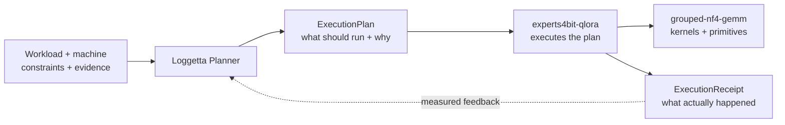

<div align="center">

# Loggetta

### Plan first. Execute through the backend.

**Loggetta turns a workload, a machine, and constraints into an inspectable execution plan.**

It selects a supported configuration, explains why it won, records why alternatives lost, and refuses impossible plans before loading weights.

<p>
  =3.10">
  
  
  
</p>

</div>

---

> [!NOTE]
> **Loggetta decides what should execute. The backend knows how to execute it.**

Loggetta owns the **Planner**, the **ExecutionPlan**, and the **ExecutionReceipt**. Its current focus is single-GPU
MoE training and serving through [experts4bit-qlora](https://github.com/pjordanandrsn/experts4bit-qlora), with
[grouped-nf4-gemm](https://github.com/pjordanandrsn/grouped-nf4-gemm) providing the packed low-bit kernel and
residency primitives beneath that runtime.

| Planner | ExecutionPlan | ExecutionReceipt |
| :--- | :--- | :--- |
| Turns hardware, workload, constraints, objectives, and evidence into a decision. | Captures the selected backend/setup, budgets, estimates, rejected alternatives, refusal reasons, warnings, and evidence quality. | Records what actually happened: memory, timing, correctness, engagement, provenance, and estimate-vs-measured deltas. |

## The loop



The ownership split is deliberate:

| Layer | Owns | Does **not** own |
| :--- | :--- | :--- |
| **Loggetta** | Hardware inventory/provenance, budgets, objectives, constraints, candidate ordering, refusal policy, `ExecutionPlan`, `ExecutionReceipt`, thin execution orchestration | Model loaders, QLoRA machinery, serving engines, residency engines, kernels |
| **experts4bit-qlora** | Model topology/conventions, admission, footprint primitives tied to its runtime, loading, adapters, QLoRA preparation, training, serving, residency/offload mechanisms | Cross-backend planning policy |
| **grouped-nf4-gemm** | Packed low-bit kernels, routing/capability facts, and low-level residency primitives | Model/runtime policy or planner decisions |

```text
Loggetta -> experts4bit-qlora -> grouped-nf4-gemm
```

No cycles. No duplicated topology. No plugin framework until a second backend actually earns one.

## Quick start

```bash
# What machine am I actually on?
python -m loggetta inspect

# Produce the artifact Loggetta exists to produce
python -m loggetta plan Qwen/Qwen3-30B-A3B --seq 2048

# Constrain the planner deliberately
python -m loggetta plan allenai/OLMoE-1B-7B-0924 --experts device --vram 6

# Execute a supported plan through the backend and write the receipt
python -m loggetta train allenai/OLMoE-1B-7B-0924 --seq 512 --micro-batch 2 --steps 12 --out receipts/
```

### Three levels of control

| Mode | Example | What it means |
| :--- | :--- | :--- |
| **Automatic** | `plan MODEL` | Let the planner choose among supported candidates. |
| **Directed** | `--vram`, `--ram`, `--experts`, `--objective` | State the budget or goal without hand-building a backend setup. |
| **Expert** | `--fix FIELD=VALUE` | Pin a backend setup field and make the remaining search work around it. |

`plan()` is pure policy: for the same inputs it returns the same serializable `ExecutionPlan`, without loading
weights or touching the device. The plan includes the winner, every relevant loser and why it lost, budget
sources, evidence labels, warnings, and explicit “not modeled” items.

`execute(plan)` is intentionally thin. It validates the plan, delegates execution to the selected backend, and
constructs an `ExecutionReceipt` from the backend result. It does **not** reimplement the runtime.

## Evidence, not vibes

Loggetta is deliberately **not** a performance oracle. It records what it knows, labels heuristics, refuses plans
it cannot support, and feeds measured receipts back into future planning.

Current checks from [`docs/RESULTS.md`](docs/RESULTS.md):

| Check | Measured result |
| :--- | :--- |
| **Planner parity, A2000 / OLMoE** | Planned and hand-composed paths had **bitwise-identical step-1 loss** (`1.858969`), effectively identical allocator peaks (`5.4710` vs `5.4706 GiB`), and the same `60,817,408` trainable parameters. |
| **Allocator estimates, A2000** | Across six measured runs spanning three model families, estimates landed **+0.01 to +0.21 GiB** from measured peaks. |
| **Qwen3-30B-A3B, RTX 5090** | Allocator estimate **22.09 GiB**, measured **21.91 GiB**. After receipt-calibrated runtime overheads: planned process peak **24.54 GiB**, measured **24.34 GiB**. |
| **Host offload** | Transfer time is treated as a **lower bound**, not a fabricated step-time prediction. |

> [!IMPORTANT]
> Evidence has a type. Measured facts stay measured; derived values stay derived; inferred values and heuristics
> stay labelled. Unknowns do not quietly become numbers.

An `ExecutionReceipt` carries provenance, allocator / reserved / driver peaks, correctness checks, engagement
evidence, timing, and estimate-vs-measured deltas. That receipt is the measured counterpart to the plan that
produced it.

## Current scope

<table>
<tr>
<th>Supported today</th>
<th>Not claimed yet</th>
</tr>
<tr>
<td valign="top">

- ✅ Single-GPU MoE planning
- ✅ First-class `ExecutionPlan` and `ExecutionReceipt` artifacts
- ✅ QLoRA planning with execution delegated to `experts4bit-qlora`
- ✅ Serving placement planning across device, host, and storage tiers
- ✅ Measured-memory feedback through receipts
- ✅ Deterministic, inspectable plans and refusals
- ✅ Explicit constraints instead of hidden “magic” defaults

</td>
<td valign="top">

- ⏳ Dense-model planning as a first-class Loggetta backend
- ⏳ Multi-GPU placement or execution planning
- ⏳ Calibrated throughput prediction
- ⏳ Profile-driven serving hot sets
- ⏳ Automatic execution of every serving plan

</td>
</tr>
</table>

Those are roadmap items, not assumptions hidden inside current results.

## Install

Until the functional PyPI release lands, install from source:

```bash
git clone https://github.com/pjordanandrsn/loggetta
cd loggetta
python -m pip install -e ".[experts4bit]"
```

The required lower-layer APIs are present in:

- `experts4bit-qlora >= 0.48.0`
- `grouped-nf4-gemm >= 0.41.0`

No development branches or `PYTHONPATH` overrides are required for those interfaces.

> [!TIP]
> PyPI `0.0.1` is the metadata-only preview used to establish the project name. Functional releases will
> supersede it.

## Why a separate planner?

Kernel selection belongs with kernels. Model topology and QLoRA mechanisms belong with the runtime. The decision
**which combination should run on this machine, under this budget, for this objective** is a separate concern,
and the `ExecutionPlan` is the durable artifact of that decision.

Keeping that boundary clean means:

- backend packages remain independently useful;
- planning stays deterministic and inspectable;
- the plan can explain both selection and refusal before weight loading;
- the runtime can evolve without absorbing cross-machine policy;
- receipts can improve future policy without contaminating kernel or model code;
- a second backend can earn a general abstraction instead of forcing one prematurely.

## Documentation

| Read this | For |
| :--- | :--- |
| [`SESSION-REPORT.md`](docs/SESSION-REPORT.md) | Short answers and current state |
| [`ARCHITECTURE.md`](docs/ARCHITECTURE.md) | Ownership boundaries and the Planner → Plan → Backend → Receipt model |
| [`RESULTS.md`](docs/RESULTS.md) | Measurements, estimator error, receipts, and what changed because of them |
| [`SERVING-PRESSURE-TEST.md`](docs/SERVING-PRESSURE-TEST.md) | Serving placement and pressure-test evidence |

<details>
<summary><strong>Tests and validation commands</strong></summary>

```bash
pytest tests/
python bench/direct_baseline.py --receipt R.json
python bench/validate_register.py
python bench/family_sweep.py --hardware hw.json
python bench/summarize_receipts.py runs/receipts
```

The fast test suite is CPU-only. GPU benchmarks and validation runs stay separate so ordinary correctness tests
do not silently become hardware-dependent.

</details>

---

<div align="center">

**Plan first. Execute through the backend. Measure. Feed the receipt back.**

</div>
