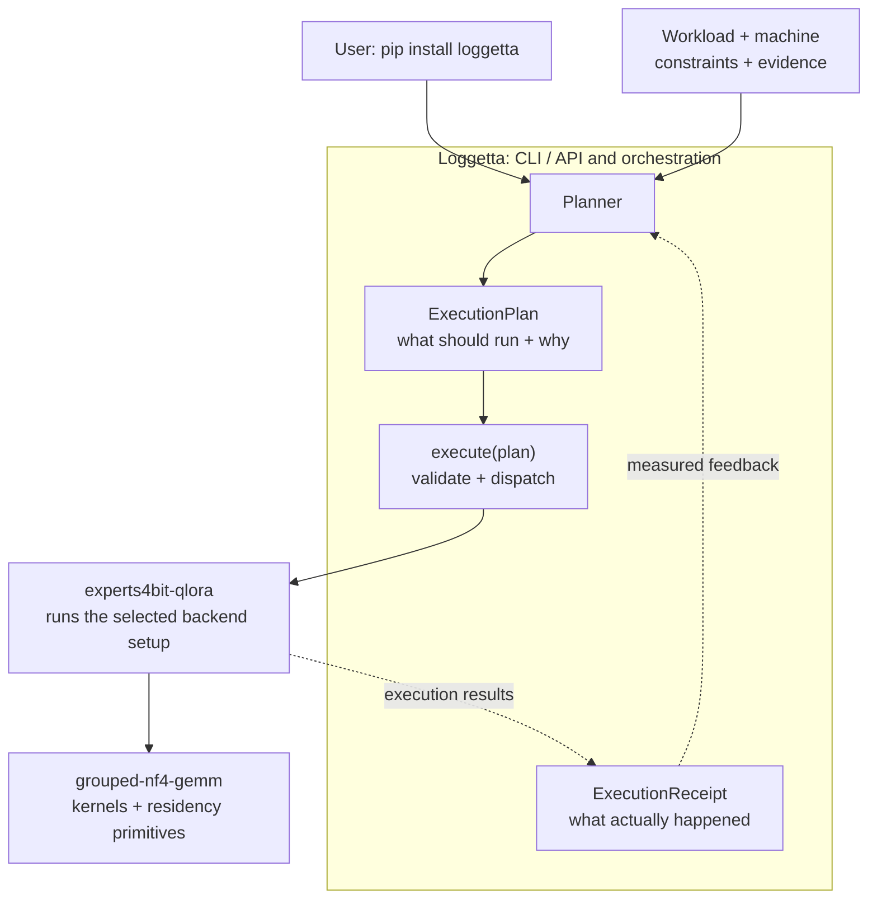

<div align="center">

# Loggetta

### One install. Plan. Run. Measure.

**The user-facing home for experts4bit-qlora and grouped-nf4-gemm.**

Plan a workload for your machine, fine-tune on your own data through the included runtime, and keep the adapters
and the run report. A **receipt** is that JSON run report: what ran, what it used, and how it compared with the plan.

<p>
  <a href="https://pypi.org/project/loggetta/"></a>
  =3.10">
  
  
  
</p>

</div>

```bash
pip install loggetta
```

**That installs the stack:** Loggetta, the [experts4bit-qlora](https://github.com/pjordanandrsn/experts4bit-qlora)
runtime with its training and fast-kernel dependencies, and [grouped-nf4-gemm](https://github.com/pjordanandrsn/grouped-nf4-gemm).
No backend extra or separate package assembly is required.

## Measured speed

The performance work lives in the **runtime and kernel layers that Loggetta installs and dispatches into**. These are measured positions for that included stack, not speedups produced by the planner itself.

| Result | Measured comparison |
| :--- | :--- |
| **2.352× faster per training step vs Unsloth** | **Qwen3-30B-A3B QLoRA on an RTX 5090**, matched adapters, initialization and tokens, with both frameworks on torch 2.12.1+cu130 / transformers 5.5.0: **3.494 vs 8.218 s/step**. Held-out loss at N=60 was **0.7569 vs 0.7557** and graded COMPARABLE. Unsloth used less peak VRAM: **24.27 vs 27.49 GB**. |
| **2.468× replication** | The same-stack Qwen3 comparison on a second RTX 5090 host: e4b **4.143 / 4.073 s/step** vs Unsloth **10.155 / 10.120 s/step**. The registered position remains 2.352×; the replication is quoted separately. |
| **2.775× vs Axolotl** | Matched-work Qwen3-30B-A3B comparison on an RTX 5090 / Ryzen 9 9950X3D host: **2.147 vs 5.956 s/step**. A separate EPYC-host reading was **1.979×**, so this ratio is explicitly host-sensitive. |
| **2.33× packed-compute throughput** | H100 synthetic expert-offload pipeline, grouped-nf4-gemm vs bitsandbytes CUDA dequantization + cuBLAS: **6.466 vs 2.773 pipeline tok/s**, **26.8 vs 59.1 J/token**. This is a pipeline result, not an end-to-end serving claim. |

Evidence: [same-stack Unsloth result](https://github.com/pjordanandrsn/experts4bit-qlora/blob/main/bench/h2h-2026-10-02/tc1/RESULTS-tc1-samestack-box4.md) · [second-host replication](https://github.com/pjordanandrsn/experts4bit-qlora/blob/main/changelog.d/tc1-amendment-42-read-samestack-host2.md) · [matched Axolotl/Unsloth result](https://github.com/pjordanandrsn/experts4bit-qlora/blob/main/bench/h2h-2026-10-02/tc1/RESULTS-tc1-matched19.md) · [H100 bnb comparison](https://github.com/pjordanandrsn/grouped-nf4-gemm/blob/main/bench/phase3/flagship/RESULTS-flagship-bnb-baseline.md)

> [!IMPORTANT]
> These are scoped, within-box measurements of the included runtime/kernel stack. They are not universal speedups, and Loggetta does not currently predict throughput. The planner chooses among supported configurations; the measurements above describe what the selected lower layers have demonstrated.

```bash
loggetta inspect
loggetta plan Qwen/Qwen3-30B-A3B --seq 2048
```

> [!NOTE]
> **Use Loggetta. The runtime and kernels come with it.**
> Loggetta owns the user-facing CLI/API, planning, execution orchestration, and run reports. Internally,
> experts4bit-qlora owns the runtime and grouped-nf4-gemm owns the kernels and low-level memory-placement tools. Those boundaries are an
> implementation detail to understand, not extra installation steps to discover.

Loggetta turns a workload, a machine, constraints, and evidence into an **ExecutionPlan**. It explains the selected
configuration, records why alternatives lost, and rejects unsupported configurations or those estimated to exceed
your budgets before loading model weights. Accepted plans are estimates, not guarantees against running out of
memory. For supported training, Loggetta calls its runtime and saves reusable native adapters plus an
**ExecutionReceipt**. Serving placement planning is included; starting the server remains a separate runtime step.

| Planner | ExecutionPlan | ExecutionReceipt |
| :--- | :--- | :--- |
| Turns hardware, workload, constraints, objectives, and evidence into a decision. | Captures the selected backend/setup, budgets, estimates, rejected alternatives, refusal reasons, warnings, and evidence quality. | Records what actually happened: memory, timing, correctness checks, which optimizations actually ran, source versions, and estimate-vs-measured differences. |

## Quick start

### Your model, your data, your adapter

With a JSONL file containing a `text` column and enough tokens for the requested steps:

```bash
loggetta train Qwen/Qwen3-30B-A3B \
  --dataset ./data/train.jsonl --format text \
  --seq 512 --micro-batch 1 --steps 20 --seed 42 \
  --out runs/my-training --adapter-out adapters/my-adapter
```

The output contains adapter tensors, the tokenizer, and a manifest of the exact runtime setup. The run report
records dataset identity, the token-stream hash, memory, timing, and checks that the chosen optimizations ran.
Existing adapter directories are never overwritten. Short datasets require an explicit `--repeat-data`.

**Current loss: all tokens, including prompts.** Text, Alpaca instruction/input/output, and text-only chat formats
are supported. Chat uses the tokenizer's own template. See [training and reloading adapters](https://github.com/pjordanandrsn/loggetta/blob/main/docs/TRAINING.md)
for Hub datasets, field mapping, fixed-shape packing, saved-plan execution, and the native artifact format.

```python
from loggetta import load_adapter
from transformers import AutoTokenizer

model = load_adapter("adapters/my-adapter", device="cuda")
tokenizer = AutoTokenizer.from_pretrained("adapters/my-adapter")
```

These are native runtime adapters, not PEFT-format checkpoints or exact optimizer-resume snapshots.

### Inspect and keep the plan

Use the `loggetta` command throughout:

```bash
# Inspect the machine
loggetta inspect

# Choose a supported configuration before loading weights
loggetta plan Qwen/Qwen3-30B-A3B --seq 2048

# Constrain the planner deliberately: device budget is in GiB
loggetta plan allenai/OLMoE-1B-7B-0924 --experts device --vram 6

# Save a training plan, including your data settings
loggetta plan allenai/OLMoE-1B-7B-0924 \
  --dataset ./data/train.jsonl --format text \
  --seq 512 --micro-batch 2 --steps 12 --out plan.json

# Execute the saved plan through the included runtime and write its receipt
loggetta execute plan.json --out receipts/

# Plan again using measured evidence from earlier runs
loggetta plan allenai/OLMoE-1B-7B-0924 \
  --seq 512 --micro-batch 2 --observations receipts/
```

For the original short Alpaca demonstration without a separate save/execute step:

```bash
loggetta train allenai/OLMoE-1B-7B-0924 \
  --seq 512 --micro-batch 2 --steps 12 --out receipts/
```

`train` combines planning and execution; it does not bypass admission checks. The equivalent
`python -m loggetta ...` commands are also supported.

For serving placement:

```bash
loggetta plan Qwen/Qwen3-30B-A3B \
  --workload serve --context 4096 --concurrency 1
```

The serving plan's *Why* carries the server environment. **`loggetta execute` does not start servers yet.**
The runtime and kernels are installed, but not every lower-layer capability has a Loggetta execution command.

### Three levels of control

| Mode | Example | What it means |
| :--- | :--- | :--- |
| **Automatic** | `loggetta plan MODEL` | Let the planner choose among supported candidates. |
| **Directed** | `--vram`, `--ram`, `--experts`, `--objective` | State the budget or goal without hand-building a backend setup. |
| **Expert** | `--fix FIELD=VALUE` | Pin a backend setup field and make the remaining search work around it. |

## How the stack runs

The CLI/API, planner, plan, execution handoff, and receipt belong to Loggetta. Execution calls the included runtime;
the runtime calls its kernels. Backend packages remain separate projects without becoming separate setup chores.



### Installed together. Responsibilities kept separate.

| Layer | Owns | Does **not** reimplement |
| :--- | :--- | :--- |
| **Loggetta** | The default stack install and user-facing CLI/API; hardware inventory/provenance; budgets, objectives, constraints, candidate ordering, refusal policy, `ExecutionPlan`, `ExecutionReceipt`, execution orchestration | Model loaders, QLoRA machinery, serving engines, residency engines, or kernels |
| **experts4bit-qlora** | Model topology/conventions, admission, footprint primitives tied to its runtime, loading, adapters, QLoRA preparation, training, serving, residency/offload mechanisms | Loggetta's planning and orchestration policy |
| **grouped-nf4-gemm** | Packed low-bit kernels, routing/capability facts, and low-level residency primitives | Model-level execution or workload planning |

```text
Loggetta -> experts4bit-qlora -> grouped-nf4-gemm
```

No cycles. No duplicated topology. No plugin framework until a second backend actually earns one.

`plan()` is pure policy: for the same inputs it returns the same serializable `ExecutionPlan`, without loading
weights or touching the device. Hardware probing and model-description gathering happen before that pure planning
step. The plan includes the winner, every relevant loser and why it lost, budget sources, evidence labels,
warnings, and explicit "not modeled" items.

`execute(plan)` validates the plan, dispatches through the selected backend executor, and writes the resulting
`ExecutionReceipt`. Before anything loads, it refuses a refused plan, a workload kind its backend only plans,
and a plan made for a different GPU (`plan --hardware`), whose receipt would name the wrong card.
The backend receives its own setup; it does not need to import Loggetta's plan types.

<details>
<summary><strong>A real plan, abridged</strong> (OLMoE-1B-7B on an RTX A2000, from <code>evidence/2026-10-04-rtx-a2000/</code>)</summary>

```text
Budget    device  10.65 GiB [reported: free now]   host  23.49 GiB [reported: available now]   headroom   0.53 GiB [policy]

Selected  backend experts4bit: experts on device, grouped_nf4 kernel

Estimated memory (each line says how it is known)
  device frozen expert stacks                    3.38 GiB  [derived]  16 stacks in nf4, blocksize 64 (packed + absmax)
  device dense weights (bf16)                    0.89 GiB  [derived]
  device optimizer state (adamw)                 0.23 GiB  [derived]
  device activations                             0.54 GiB  [heuristic]  16 saved layer inputs (T x H bf16) + ...
  device allocator reserve (cached, unallocated blocks)   1.17 GiB  [measured]  receipt ...173932Z: ... = 0.222
  device CUDA context + library workspaces       0.13 GiB  [measured]  receipt ...173932Z
  device total                                   6.56 GiB   of  10.65 GiB budget

Why
  - experts resident on the device: 6.56 GiB estimated + 0.53 GiB headroom fits the 10.65 GiB budget
  - ordering, expert_kernel: grouped_nf4 before reference: e4b.train.h2h.unsloth.olmoe.5090.2026-09-19 (1.39 vs 14.88 s/step), ...

Performance  not predicted: no performance model is calibrated for this backend yet; ...

Alternatives considered
  [fits ] experts on device, grouped_nf4 kernel, NF4 attention       device   6.10 GiB  host   0.72 GiB  ...
  [fits ] experts on host, grouped_nf4 kernel                        device   2.69 GiB  host   4.10 GiB  ...
  ...
```

Its receipt: allocator 5.26 GiB estimated, 5.47 GiB measured; driver 6.56 GiB estimated, 6.82 GiB measured.

</details>

## Evidence, not vibes

Loggetta is deliberately **not** a performance oracle. It records what it knows, labels heuristics, refuses plans
it cannot support, and feeds measured receipts back into future planning.

Checks from [`docs/RESULTS.md`](https://github.com/pjordanandrsn/loggetta/blob/main/docs/RESULTS.md), for those specific boxes and workloads, not universal error bounds:

| Check | Measured result |
| :--- | :--- |
| **Planner parity, A2000 / OLMoE** | Planned and hand-composed paths had **bitwise-identical step-1 loss** (`1.858969`), effectively identical allocator peaks (`5.4710` vs `5.4706 GiB`), and the same `60,817,408` trainable parameters. |
| **Allocator estimates, A2000** | Across six measured runs spanning three model families, allocator estimates were within **0.01 to 0.21 GiB** of measured peaks. |
| **Qwen3-30B-A3B, RTX 5090** | Allocator estimate **22.09 GiB**, measured **21.91 GiB**. After receipt-calibrated runtime overheads: planned process peak **24.54 GiB**, measured **24.34 GiB**. |
| **Serving tiers, A2000 / OLMoE** | The planned VRAM / DRAM / NVMe split matched the server's own (**272 / 421 / 331** experts); allocator **2.052** GiB planned, **2.051** GiB measured. |
| **Host offload** | Transfer time is treated as a **lower bound**, not a fabricated step-time prediction. |
| **Included runtime speed, Qwen3-30B-A3B / RTX 5090** | Same-stack matched-work training measured **3.494 s/step for e4b vs 8.218 s/step for Unsloth (2.352×)**, with comparable held-out loss; replicated at **2.468×** on a second host. |

> [!IMPORTANT]
> Evidence has a type. Measured facts stay measured; derived values stay derived; inferred values and heuristics
> stay labelled. Unknowns do not quietly become numbers.

An `ExecutionReceipt` records source versions, allocated / reserved / driver-reported memory peaks, correctness
checks, confirmation that selected optimizations ran, timing, and differences between estimates and measurements. That receipt is the measured counterpart to the plan that
produced it.

## Current scope

| Available today | Not claimed yet |
| :--- | :--- |
| Default installation of Loggetta, its runtime, and its kernels | First-class dense-model planning |
| Single-GPU MoE planning | Multi-GPU placement or execution planning |
| Saved `ExecutionPlan` and `ExecutionReceipt` artifacts | Calibrated throughput prediction |
| Your dataset, QLoRA execution, reusable native adapters, and tokenizer export | Exact optimizer-state resume or assistant-only loss |
| Serving placement planning across device, host, and storage tiers | A Loggetta server-launch command |
| Measured-memory feedback, explicit constraints, and inspectable refusals | Universal support for every mechanism exposed by the lower packages |

Those are scope boundaries, not assumptions hidden inside current results. The train/save/reload path has CPU
coverage using real runtime LoRA modules; a separate tiny-model CUDA integration test is available for GPU runs.
This is not a claim of GPU validation across all supported model families.

## Installation details

**Starting with 0.1.1, the default install includes the runtime and kernel packages.** There is no planner-only
default that needs an extra to become useful. The dependency footprint is intentional: the default command is
meant to run supported workloads, not leave users to assemble the runtime afterward.

| Installed package | Role |
| :--- | :--- |
| **Loggetta** | Planner, `ExecutionPlan`, `ExecutionReceipt`, CLI/API, orchestration, and measured feedback |
| **experts4bit-qlora[train,fast] >= 0.48.0** | Model loading, QLoRA, training, serving, and residency, with the training and fast-path dependencies enabled |
| **grouped-nf4-gemm >= 0.41.0** | Packed low-bit kernels and residency primitives |
| **datasets** | Data loading used by the training path |

Upgrading an earlier installation:

```bash
python -m pip install --upgrade loggetta
```

The old `loggetta[experts4bit]` spelling remains accepted as a compatibility alias. It is no longer necessary.
Both lower packages can still be installed and used independently.

> [!IMPORTANT]
> Installing the stack does not remove its hardware requirements. GPU execution still needs a supported device,
> driver, and compatible PyTorch installation. The current Loggetta command surface executes training plans and
> produces serving plans; it does not yet launch the server itself.

The minimum backend releases support training plans and execution plus serving plans. The newer serving-estimate
refinements in RESULTS 6b-6e require APIs beyond e4b `0.48.0`; that minimum release is not sufficient to reproduce
those specific measurements. See [`docs/RESULTS.md`](https://github.com/pjordanandrsn/loggetta/blob/main/docs/RESULTS.md) for the backend revisions used.

Source installation for development:

```bash
git clone https://github.com/pjordanandrsn/loggetta
cd loggetta
python -m pip install -e .
```

## How does this compare with Accelerate?

[Accelerate's `estimate-memory`](https://huggingface.co/docs/accelerate/usage_guides/model_size_estimator)
already estimates a model's total and largest-layer size, with an Adam-training estimate, without downloading
its full weights. Pre-load estimation alone is not unique to Loggetta.

Accelerate also has [Big Model Inference](https://huggingface.co/docs/accelerate/concept_guides/big_model_inference),
including automatic device maps and CPU/disk offload. That documented inference path is distinct from its training
facilities; Accelerate as a whole is not merely a memory calculator.

Loggetta's focus is the **configuration -> execution -> measured feedback** loop for its included runtime:
choose among supported MoE configurations, explain selections and refusals, run supported QLoRA training, save
adapters, and use the resulting run reports to inform later plans. It is not a replacement for Accelerate's broader
training/distributed infrastructure. No matched estimator-accuracy comparison has been run; the measurements above
are not a claim of superiority over Accelerate.

## Why keep the packages separate?

**One install does not require one codebase.** Kernel selection belongs with kernels. Model topology and QLoRA
mechanisms belong with the runtime. Loggetta brings them together, decides which combination should run on this
machine under the user's constraints, and makes that decision inspectable before execution.

The separation lets e4b and gnf4 remain independently useful, keeps backend knowledge with its owner, and allows
receipts to improve planning policy without moving model or kernel code into the planner. Users get one starting
point; maintainers keep clear boundaries.

## Documentation

| Read this | For |
| :--- | :--- |
| [`TRAINING.md`](https://github.com/pjordanandrsn/loggetta/blob/main/docs/TRAINING.md) | Bring your data, save adapters, reload them, and understand loss/packing semantics |
| [`SESSION-REPORT.md`](https://github.com/pjordanandrsn/loggetta/blob/main/docs/SESSION-REPORT.md) | Short answers and current state |
| [`ARCHITECTURE.md`](https://github.com/pjordanandrsn/loggetta/blob/main/docs/ARCHITECTURE.md) | Ownership boundaries and the Planner -> Plan -> Backend -> Receipt model |
| [`RESULTS.md`](https://github.com/pjordanandrsn/loggetta/blob/main/docs/RESULTS.md) | Measurements, estimator error, receipts, and what changed because of them |
| [`SERVING-PRESSURE-TEST.md`](https://github.com/pjordanandrsn/loggetta/blob/main/docs/SERVING-PRESSURE-TEST.md) | Serving placement and pressure-test evidence |

<details>
<summary><strong>Tests and validation commands</strong></summary>

```bash
python -m pip install -e ".[test]"
pytest tests/
python bench/direct_baseline.py --receipt R.json
python bench/validate_register.py
python bench/family_sweep.py --hardware hw.json
python bench/summarize_receipts.py runs/receipts
```

The fast test suite is CPU-only. Planner tests use the installed backend packages; individual tests may skip
when a platform cannot import a required kernel module. Execution handoff tests use a stand-in executor rather
than launching training. GPU benchmarks and validation runs remain separate.

</details>

---

<div align="center">

**Install Loggetta. Plan. Run. Measure. Feed the receipt back.**

</div>